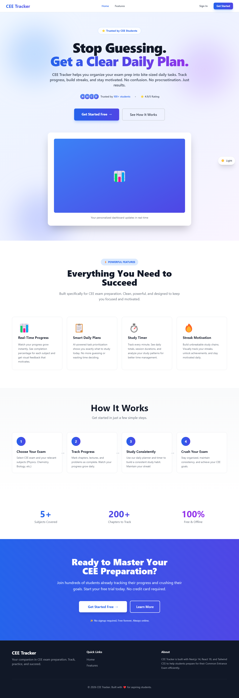
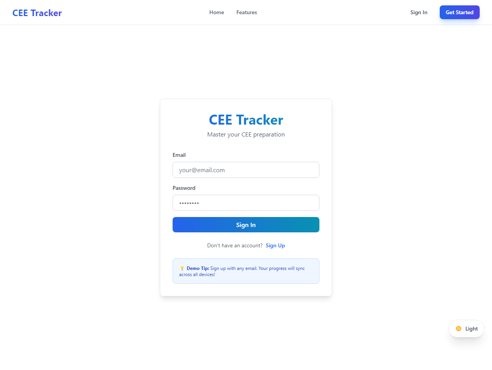
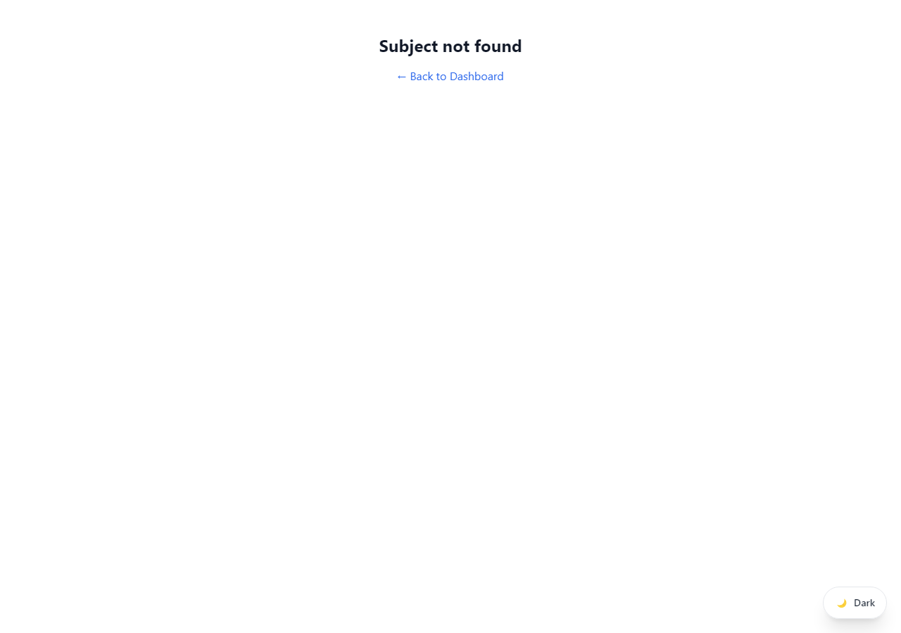
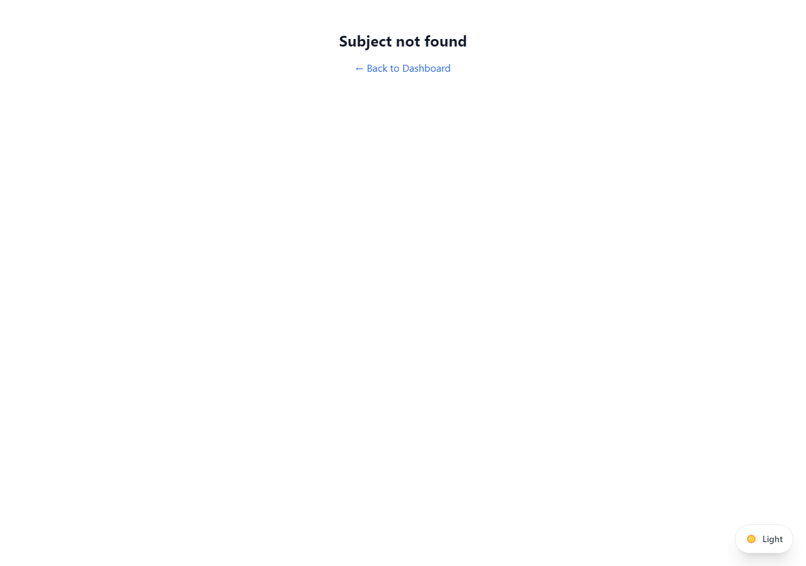

# CEETracker — Complete Project README

CEETracker is a focused study planner and progress tracker built on Next.js (App Router), React, Tailwind CSS and optional Firebase. It helps students organize subjects and chapters, run short study sessions, track streaks, and review quiz/history data.

This README is a complete, developer-friendly guide covering installation, features, routes, data model, theme, screenshots, and common troubleshooting steps.

**Quick links**

- Dev server: `npm run dev` (opens on the port printed in the terminal; commonly `http://localhost:3000`).
- Production build: `npm run build && npm start`.

## Table of contents

- Project overview
- Features
- Routes & pages
- Key components and files
- Data model (localStorage & Firestore paths)
- Theme (dark / light) and default
- Installation & local development
- Screenshots (placeholders + capture instructions)
- Troubleshooting
- Contributing

## Project overview

CEETracker provides:

- A dashboard with subject cards and progress summaries.
- Per-subject pages with chapter lists and completion tracking.
- A daily challenge / quiz flow with persistence and per-user history.
- A persistent study timer with per-day snapshots and a dedicated Study Timer page.
- Streak tracking and a challenge history browsing page.

The app aims to work offline-first using `localStorage` and optionally sync to Firestore when Firebase is configured.

## Features (expanded)

- Dashboard: aggregated view of subjects with progress indicators and quick links to subject pages.
- Subject page: chapter accordion with check/uncheck, subtopics, filters, and search.
- Daily Challenge: server-assisted plan generation (calls `/api/generate-daily-plan`) with deterministic fallback and caching.
- Quiz & Result Persistence: quiz results are written to localStorage and (optionally) Firestore; history page allows per-day browsing and per-question review.
- Study Timer: start/pause/reset session timer; snapshots are recorded at midnight and shown in the Study Timer page.
- Streak Tracker: increments on challenge completion, persisted and synchronized between open tabs.
- Theme support: dark and light modes; default is dark.

## Routes & pages

Primary user-facing routes in the app (App Router):

- `/` — Dashboard / Landing (app/page.js)
- `/subject/[name]` — Per-subject detail page (app/subject/[name]/page.js)
- `/study-timer` — Dedicated Study Timer page (app/study-timer/page.js)
- `/challenge-history` — Challenge history and stats (app/challenge-history/page.js)
- `/login` — Sign-in page (components/LoginComponent.js used in auth flows)

API routes:

- `/api/generate-daily-plan` — Generates or retrieves cached daily plan. Uses Google Gemini when configured and falls back to deterministic plan generation when the AI service is unavailable.

Use the route file references to inspect code:

- [app/page.js](app/page.js#L1)
- [app/subject/[name]/page.js](app/subject/[name]/page.js#L1)
- [app/study-timer/page.js](app/study-timer/page.js#L1)
- [app/challenge-history/page.js](app/challenge-history/page.js#L1)
- [app/api/generate-daily-plan/route.js](app/api/generate-daily-plan/route.js#L1)

## Key components & where to find them

- `components/Navbar.js` — main navigation, includes links to Study Timer and Challenge History and shows a compact streak badge.
- `components/SubjectCard.js` — subject summary card used on the dashboard.
- `components/ChapterAccordion.js` — expandable chapter entries with checkboxes and nested items.
- `components/TodaysPlan.js` — today's plan + daily challenge UI, triggers quiz flow and records progress.
- `components/QuizPage.js` — quiz UI that captures per-question correctness and posts results to history.
- `components/StudyTimer.js` — shared timer UI used both in navbar and in dedicated Study Timer page.
- `components/StreakTracker.js` — dashboard streak UI and logic.
- `components/ThemeToggle.js` — theme toggle UI (light/dark).

Utilities and libraries:

- `lib/storage.js` — read/write helpers for localStorage, theme helpers, study-timer helpers, and keys used across the app.
- `lib/dailyChallenge.js` — date helpers, plan/progress keys, streak helpers, timer snapshot helpers and event emitters.
- `lib/firebase.js` — optional Firebase initialization (auth + Firestore) used when `.env.local` is configured.

## Data model — localStorage keys & Firestore paths

LocalStorage keys (used by `lib/storage.js` and other helpers):

- `cee-tracker-theme` — theme preference (`light` | `dark`). Default: `dark`.
- `study-streak` — streak object: {lastCheckInDate: "YYYY-MM-DD", count: number, ...}.
- `daily-challenge-history` — aggregated local history for offline-first reads (structure: { dateString: { subject: [...results] } }).
- `study-timer-snapshots` — per-day timer totals recorded on midnight rollover.

Firestore paths (optional — when Firebase is configured):

- `dailyPlans/{date}` — cached daily plan documents created by `/api/generate-daily-plan` server code.
- `users/{userId}/dailyChallengeHistory/{date}` — per-user challenge history documents (mirrors local history when sync is enabled).

## Theme (Dark / Light)

Dark mode is the default. Theme utilities are implemented in `lib/storage.js`:

- `readThemePreference()` — returns `dark` by default unless user changed it.
- `writeThemePreference(theme)` — sets `light` or `dark` and updates `document.documentElement.classList`.
- `applyStoredThemePreference()` — helper used at boot to apply the theme before React paints.

User-facing toggle: `components/ThemeToggle.js` listens for the `cee-theme-updated` event and toggles theme. You can also toggle theme manually in the browser console:

1. Make the page dark: `localStorage.setItem('cee-tracker-theme','dark'); document.documentElement.classList.add('dark');`
2. Make the page light: `localStorage.setItem('cee-tracker-theme','light'); document.documentElement.classList.remove('dark');`

If you want to change the default theme to light by code, update `readThemePreference()` in [lib/storage.js](lib/storage.js#L1) to return `light` instead of `dark`.

## Installation & local development

Prerequisites: Node 18+ recommended.

1. Clone the repo

git clone <repo-url>
cd CEETracker

2. Install dependencies

npm install

3. Start dev server

npm run dev

4. Open the URL printed by the dev server (usually `http://localhost:3000`).

Build for production:

npm run build
npm start

Useful commands

- `npx prettier --write .` — format files
- `npm run dev` — start dev server
- `npm run build` — production build

## Screenshots (placeholders)

Add screenshots under `public/screenshots/` and reference them here. Suggested screenshot set:

- `public/screenshots/dark-home.png` — Dashboard in dark mode
- `public/screenshots/light-home.png` — Dashboard in light mode
- `public/screenshots/study-timer.png` — Study Timer page
- `public/screenshots/challenge-history.png` — Challenge history page
- `public/screenshots/subject-page.png` — Subject detail with chapter list

Example Markdown embed (screenshots captured and added to `public/screenshots`):

- Dark dashboard: 
- Light dashboard: 
- Dark study timer: 
- Light study timer: 
- Dark challenge history: 
- Light challenge history: 
- Dark subject page (Physics): 
- Light subject page (Physics): 

Capture tips (manual):

- Start dev server: `npm run dev`
- Visit the page you want to capture and toggle the theme if needed.
- Use your OS screenshot tool or `npx playwright screenshot --url=http://localhost:3000 --output=public/screenshots/dark-home.png` (example — install Playwright first).

If you'd like, I can automatically capture and add these screenshots to the repo — tell me which pages you want captured and I'll run them and update README with the actual images.

## API: `/api/generate-daily-plan`

Server route responsibilities:

- Attempts to generate a daily plan using Google Gemini (if configured).
- Falls back through a chain of Gemini models and to a deterministic generator if the AI service is unavailable.
- Caches the generated plan in Firestore at `dailyPlans/{date}` (if Firestore is configured) and returns the plan JSON to clients.

See: [app/api/generate-daily-plan/route.js](app/api/generate-daily-plan/route.js#L1)

## Behavior details & UX notes

- Daily Challenge flow: When the user opens Today's Plan the app requests `/api/generate-daily-plan`. When a quiz is completed the result object (score, answers, completedAt) is saved into local history and optionally pushed to Firestore.
- Streak updates: completing a daily challenge triggers `incrementStudyStreakIfNeeded()` in `lib/dailyChallenge.js`. The navbar and dashboard listen to `study-streak-updated` events to keep UI in sync across tabs.
- Study Timer: the timer updates a snapshot every tick and records a midnight rollover snapshot into `study-timer-snapshots` so totals per day are preserved even if the user leaves the app open overnight.

## Troubleshooting & common fixes

- If the dev server fails to start: remove any process holding port 3000 or run `npm run dev -- -p <port>` to pick a different port.
- If you see UI mismatch or missing dark styles: verify `document.documentElement` contains `class="dark"` for dark mode. Run `applyStoredThemePreference()` from `lib/storage.js` at boot time.
- If Firebase features fail: check `.env.local` variables and restart the server.

## Contributing

1. Fork → branch → implement
2. Run `npm run dev` and validate changes
3. Run `npx prettier --write .`
4. Open a PR with concise description and screenshots (if UI changes)

## License

No license file included. Add a `LICENSE` file or contact the project owner for licensing terms.

---
